# revit-quantity-takeoff-addin

Revit 안에서 실행되는 모델리스(Modeless) 애드인입니다. 벽·바닥·기둥·보의 수량을 **타입·레벨별로 추출**해 표로 보여주고, **CSV로 내보내기·가져오기**를 하며, 실(Room) 마감 등 일부 요소를 자동 생성합니다.

> **출처 안내** — WinForm 기본 틀은 수업(BIM-IT 과정)에서 제공받았습니다. 버튼별 기능 구현과 확장(데이터 추출, CSV 입출력, 실 마감 생성기, 문 배치 등)은 직접 작업했습니다.

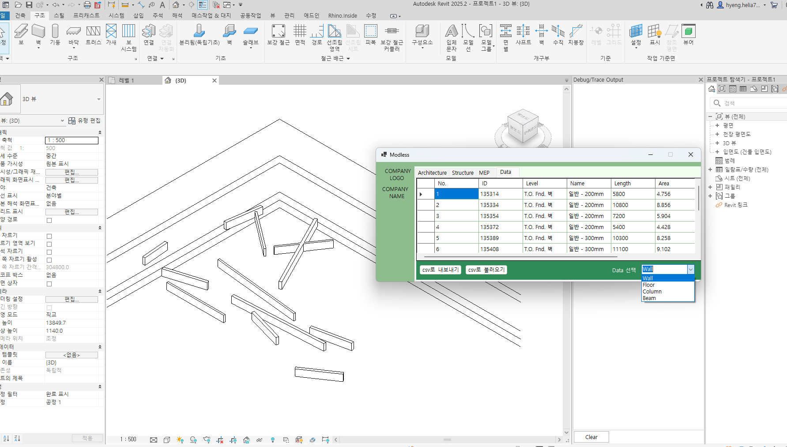

## 주요 기능

### 1. 데이터 추출 (Data 탭)
카테고리를 고르면 `FilteredElementCollector`로 요소를 모아 표로 보여주고, 마지막에 합계를 계산합니다.

| 카테고리 | 산출값 |
|---|---|
| Wall | 길이, 면적, 기준 레벨, 시작·끝 좌표(X/Y/Z) |
| Floor | 둘레, 면적, 레벨 |
| Column | 길이, 체적, 레벨 |
| Beam | 길이, 체적, 레벨 |

내부 단위(ft)는 mm · m² · m³로 변환해 표시합니다.

| Floor | Column | Beam |
|---|---|---|
| 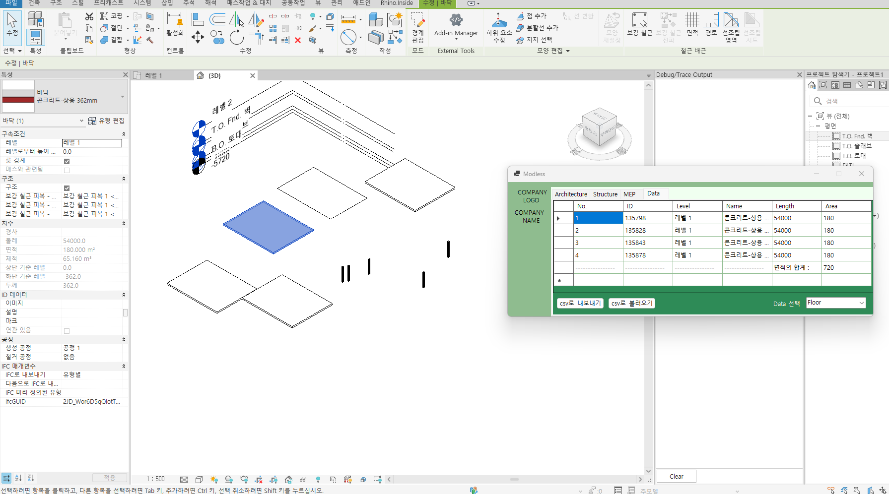 | 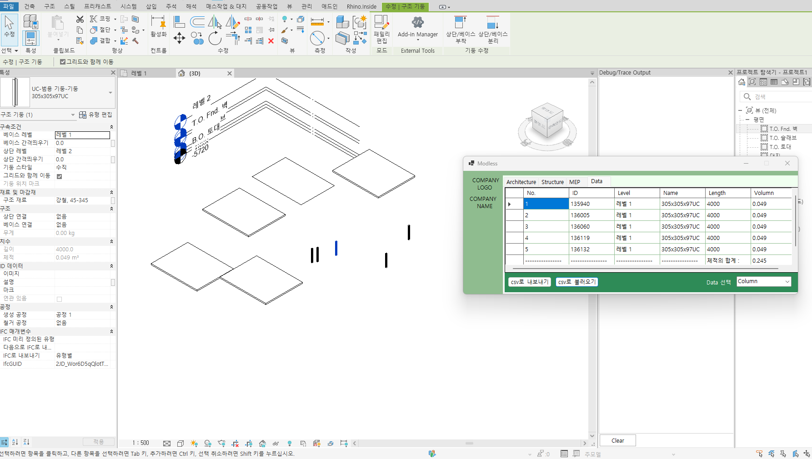 | 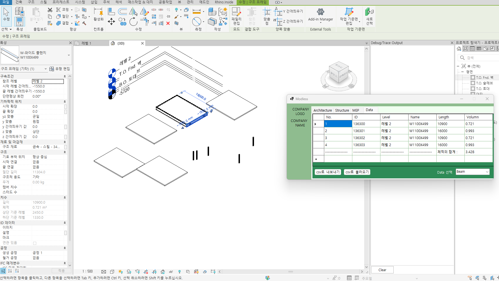 |

### 2. CSV 내보내기 / 가져오기
- 내보내기: 그리드의 헤더와 데이터 행을 UTF-8 CSV로 저장합니다. 합계 행은 제외하고, 행 끝 쉼표 없이 저장하며, 쉼표·따옴표가 있는 값은 `"..."`로 감쌉니다.
- 가져오기: 시작·끝점 좌표가 들어 있는 벽 CSV를 읽어 `Wall.Create`로 벽을 생성합니다. 3D 뷰에서도 동작하도록 CSV의 레벨명(없으면 Z값이 가장 가까운 레벨)을 사용합니다.
- 샘플 파일은 [`samples/`](samples)에 있습니다. 좌표가 있는 파일은 `WALL.csv`, `wall_data3.csv`입니다.

| 내보내기 | 가져오기 | 결과 |
|---|---|---|
| 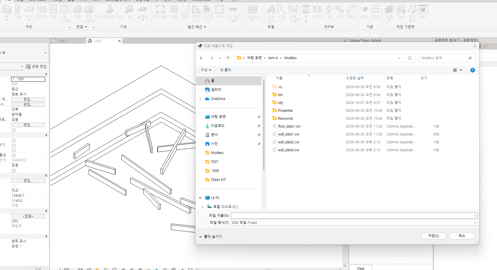 | 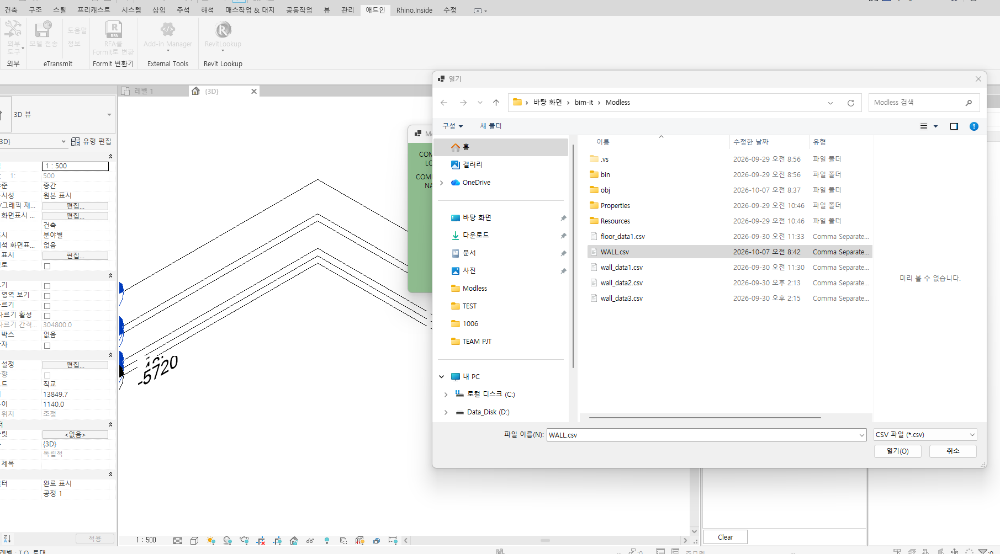 | 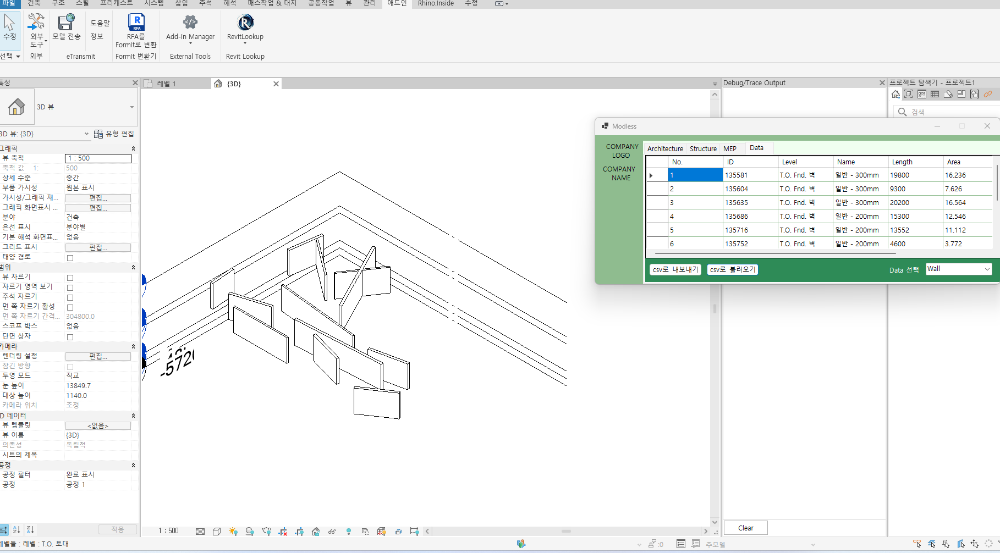 |

### 3. 실(Room) 마감 생성기와 문 배치
- Room을 선택하면 마감 경계(`SpatialElementBoundaryLocation.Finish`)를 따라 바닥·벽·천장을 체크한 항목만 생성합니다.
- 슬래브 상단 높이는 `ReferenceIntersector`로 아래 방향 레이를 쏴서 계산합니다.
- 평면에 그린 디테일 라인과 벽 중심선의 교점을 구해 호스트 벽에 문을 배치합니다.
- 그 외 보(면의 모서리 곡선 기반), 마감벽(면의 외곽선 기반), 기둥(하단·상단 레벨 지정) 생성 기능이 있습니다.

| 마감 생성 전 | 마감 생성 후 | 문 배치 전 | 문 배치 후 |
|---|---|---|---|
| 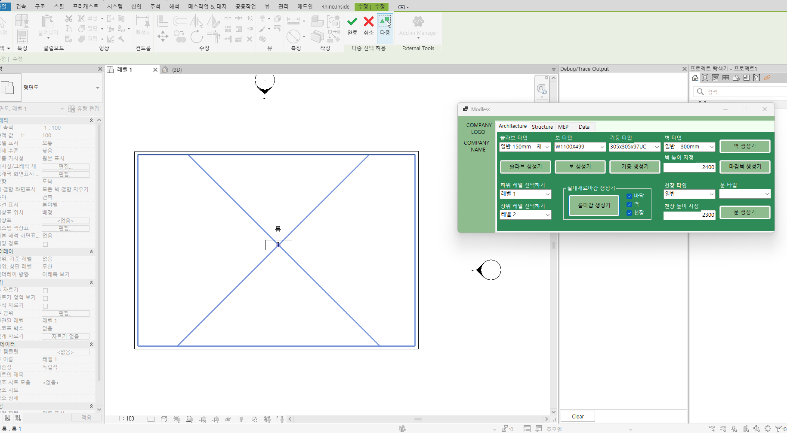 | 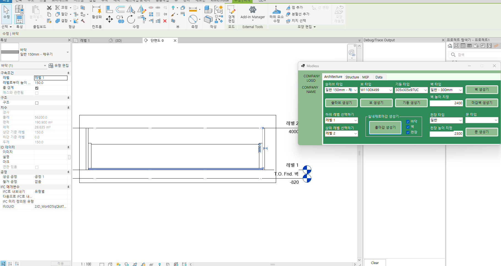 | 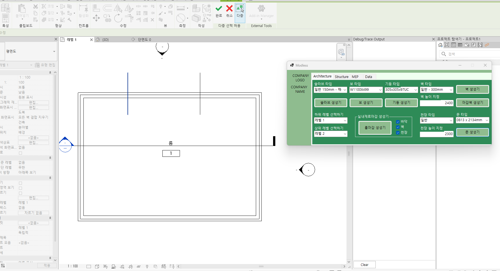 | 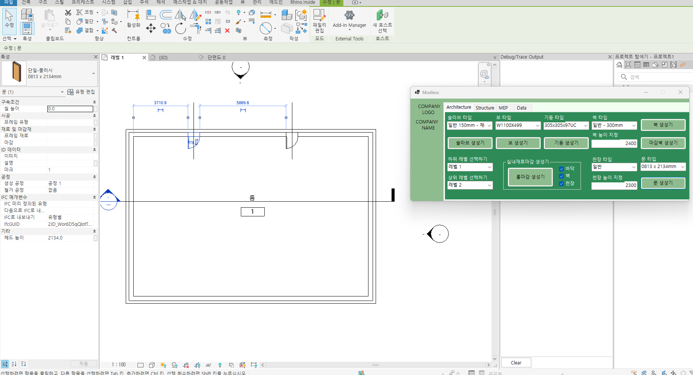 |

## 기술 스택
- C# / .NET 8, Windows Forms
- Revit API 2025 (`IExternalCommand`, `IExternalEventHandler` / `ExternalEvent`)

## 빌드와 설치
1. Revit 2025가 `C:\Program Files\Autodesk\Revit 2025\`에 설치되어 있어야 합니다. 다른 경로라면 `src/Modless/Modless.csproj`의 `HintPath`를 수정하세요. (Revit DLL은 이 저장소에 포함되어 있지 않습니다.)
2. 빌드:
   ```bash
   dotnet build src/Modless/Modless.csproj
   ```
3. 빌드 결과(`Modless.dll`)와 `Icon32.png`를 원하는 폴더에 두고, `Modless.addin`의 `Assembly`·`LargeImage` 경로를 맞춘 뒤 `%AppData%\Autodesk\Revit\Addins\2025\`에 복사합니다.
4. Revit을 시작하면 **애드인 > 외부 도구**에 명령이 나타납니다.

## 포트폴리오
요약 자료: [docs/portfolio.pdf](docs/portfolio.pdf)

## 알려진 제한
- CSV 가져오기는 벽만 지원하며, 쉼표가 들어간 값(따옴표로 감싼 값)은 가져오기에서 해석하지 않습니다.
- 실사용 전 테스트용 모델에서 먼저 실행해 보세요. 가져오기와 생성 기능은 모델에 요소를 추가합니다.
